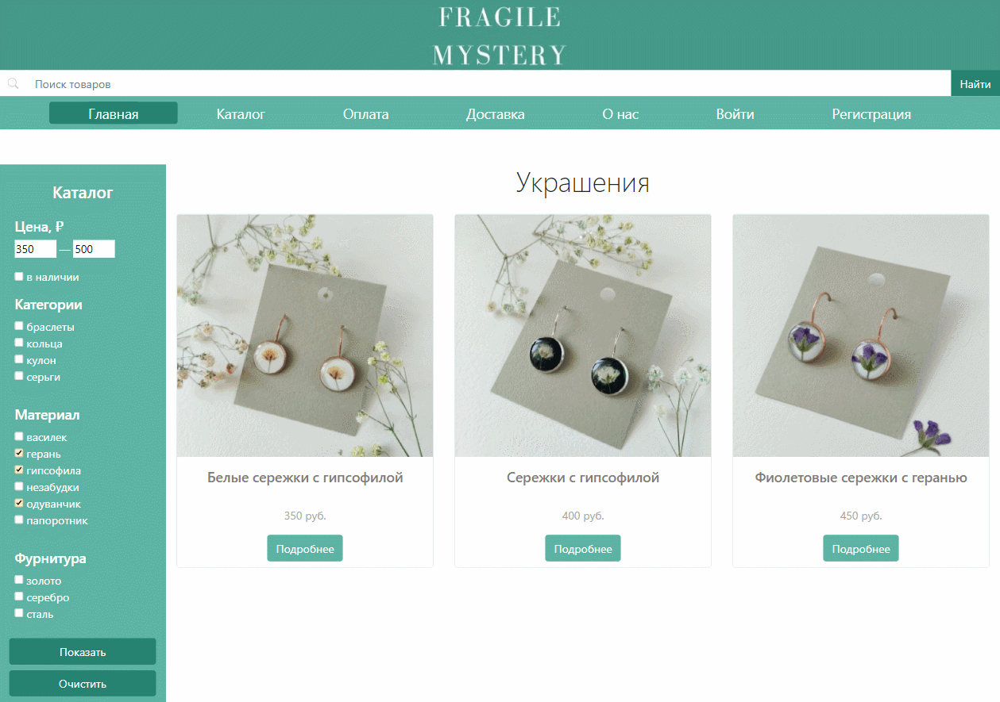
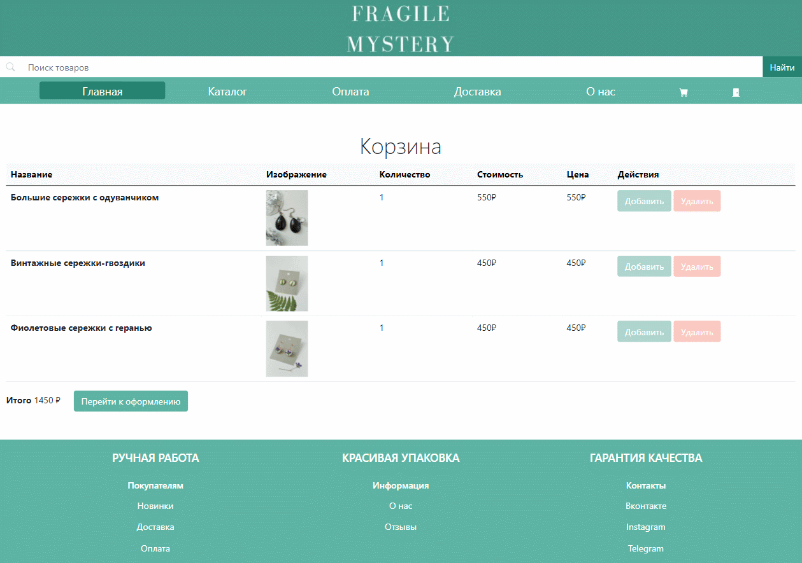
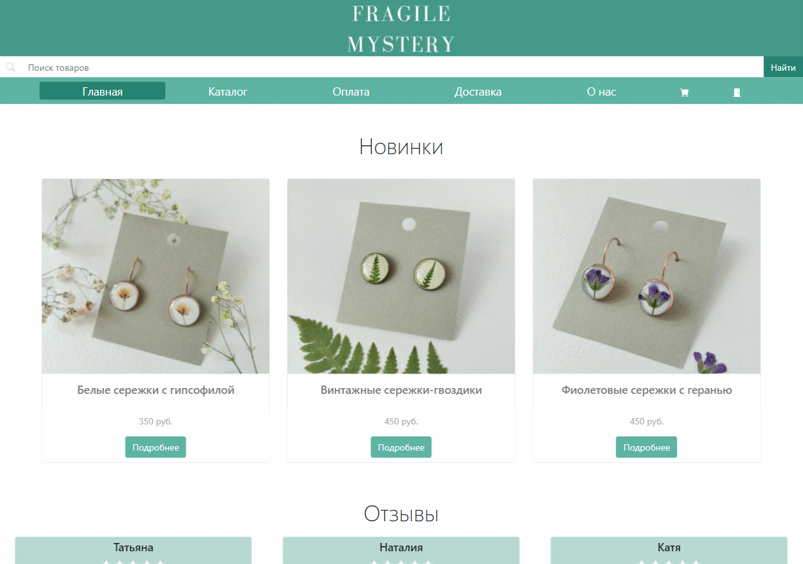

# Магазин украшений из эпоксидной смолы

## Что реализовано
В ходе разработки были созданы следующие страницы:
* Домашняя страница с новинками и отзывами клиентов
* Страница каталога украшений с фильтрами и поиском по названию
* Страница регистрации/авторизации    
* Страница с корзиной выбранных товаров
* Страница оформления заказа
* Информационные страницы (о доставке, об оплате, о магазине)

## Что пока не реализовано
* Не привязан интернет-эквайринг (оплата оговаривается и производится при последующем разговоре с клиентом)
* Отсутствует страница со стадией выполнения заказа (на вопросы о сроках отвечает мастер в чате, данные для отслеживания отправляются клиенту)

## Быстрая презентация
### Домашняя страница

### Каталог

### Вход и регистрация

### Просмотр украшения

### Заказ

### Информационные страницы



## Текущий стек технологий
* Front-end: HTML, CSS, Bootstrap
* Back-end: Django, SQLite


## Установка
```bash
git clone https://github.com/Daniil-Solo/Jewelry-Shop-on-Django
cd Jewelry-Shop-on-Django
python -m venv venv
venv\Scripts\activate
pip install -r requirements.txt
cd jewshop
python manage.py runserver
```